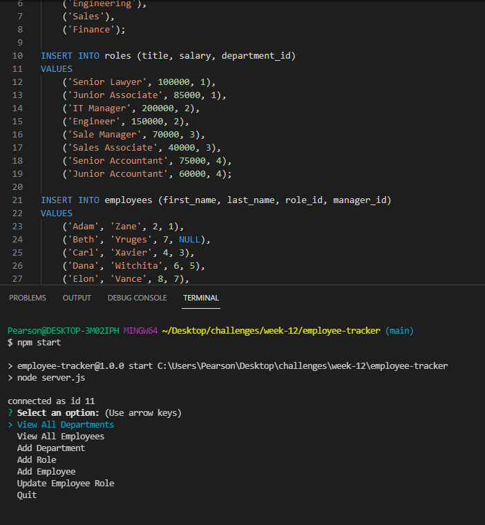

# Employee Tracker
## Description
An Inquirer content managent system that utilizes SQL to maintain a databse of a business' departments, roles, eployees, and salaries.
## Built With
* SQL
* Node
* Inquirer
## Preview

## Questions
If you have any further questions about this application / repository feel free to contact me at: 
* [GitHub](https://github.com/jpkashlak)
* E-Mail: jpkashlak@gmail.com
